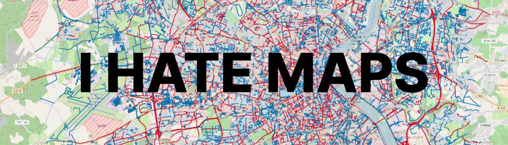

<h1 align="center">.tiff viewer</h1>

<p align="center"></p>

## Description.
Project implemented on Python with using [fastAPI](https://fastapi.tiangolo.com/) framework. The user uploads .tiff
image and by its result can see the correct binding of its image to the map. Coordinates are attached to the picture and
its owner can view the polygon in the area where the picture was taken.

## How to use?
It's as simple as that. Click the upload image button, and admire our creation.

## About the project.
- .tiff viewer implemented with [React.js](https://react.dev/) and [OpenLayers](https://openlayers.org/) library on Front-end.
- On the backend we used [Python 3.8](https://www.python.org/), [fastAPI](https://fastapi.tiangolo.com/) framework.

## Project setup.
```
# Creating venv.
python3 -m venv venv

# Activate venv.
source venv/vin/activate

# Install dependencies.
pip install -r requirements.txt

# Build docker image.
docker-compose build

# Up db container.
docker-compose up db

# Run the server from project root.
uvicorn app.main:app --reload

# Check for errors in the logs if this doesn't work via
docker-compose logs -f
```
